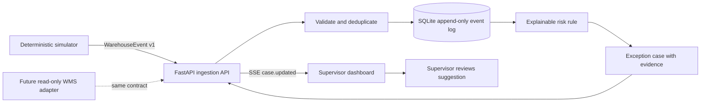

# Architecture and operating flow

## First vertical slice

The simulator and a future warehouse connector both publish the same `WarehouseEvent` contract. The API validates each event, stores it once, rebuilds the order view, and evaluates the risk rule. A 30-second local re-check also reevaluates known orders as deadlines approach, even when the event stream is quiet. The dashboard receives case changes over SSE. A future WMS adapter can replace the simulator without changing the risk engine or dashboard, provided its events map to the agreed contract.

## Initial exception

An order has five expected lines. Four have been picked. The fifth line is short-picked, reserve stock is available, the carrier cutoff is approaching, and no replenishment task has started. The system opens a case, lists those facts as evidence, and recommends that a supervisor release replenishment and monitor the order. The software does not execute warehouse actions.

The rule is deterministic. It does not need machine learning or real customer data to be implemented and tested. Synthetic data is enough to test event ingestion, ordering, duplicate handling, case generation, and UI updates. Real warehouse data is required to validate production thresholds and semantics.

## Components

- **Event contract:** `contracts/warehouse-event.v1.schema.json`; stable boundary between teammates and future integrations.
- **Ingestion and case API:** `backend/warehouse_rescue/main.py`; validates input, accepts events, exposes cases and SSE.
- **Event store:** `backend/warehouse_rescue/store.py`; SQLite for a zero-service local prototype, preserving the event log.
- **Risk rules:** `backend/warehouse_rescue/risk.py`; pure, explainable decision logic.
- **Simulator:** `backend/warehouse_rescue/simulator.py`; emits a repeatable synthetic scenario.
- **Dashboard:** `web/`; presents current cases and listens for updates.

## Boundaries and later work

SQLite and a single API process are appropriate for getting the first end-to-end slice running. Before shared deployment, replace SQLite with PostgreSQL, move event processing and deadline re-checks to a durable worker/outbox, add authentication and tenant/warehouse scoping, and add retry/replay monitoring. Add a partner-specific adapter behind the common event contract. Keep the initial integration read-only; any future action execution should be allowlisted, explicitly approved, and verified against a follow-up warehouse event.

An optional language model may later help phrase evidence for a person, but it must not invent evidence, determine risk, or execute a warehouse action. The rules and evidence remain the source of truth.
